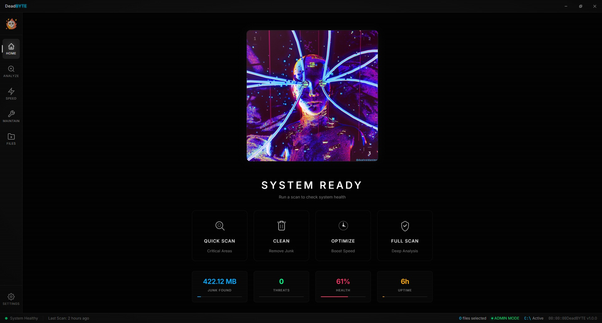
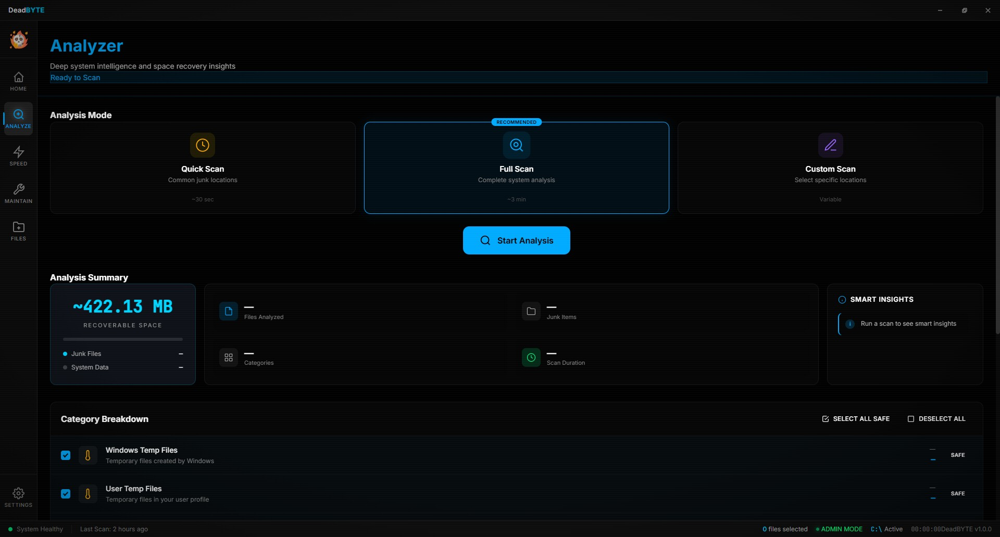
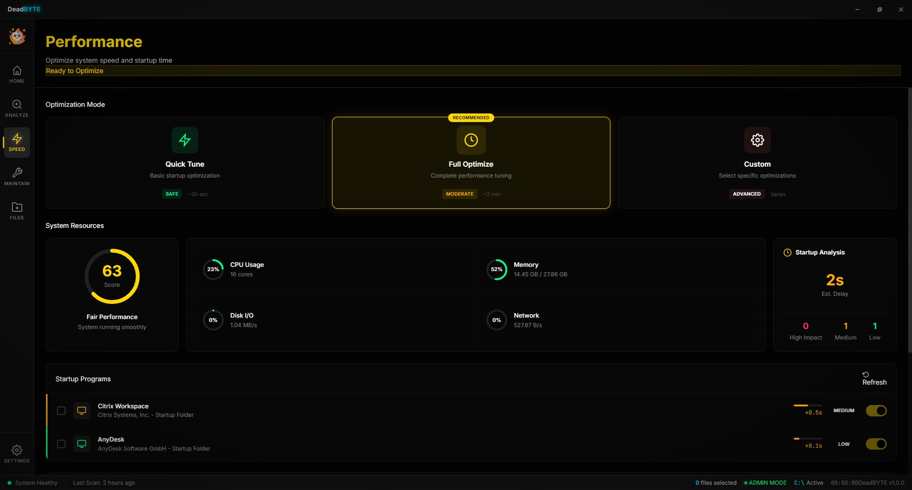
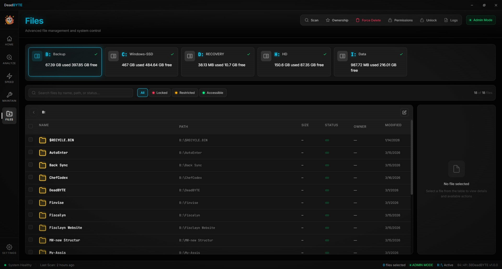
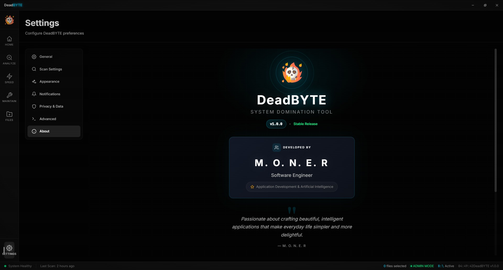
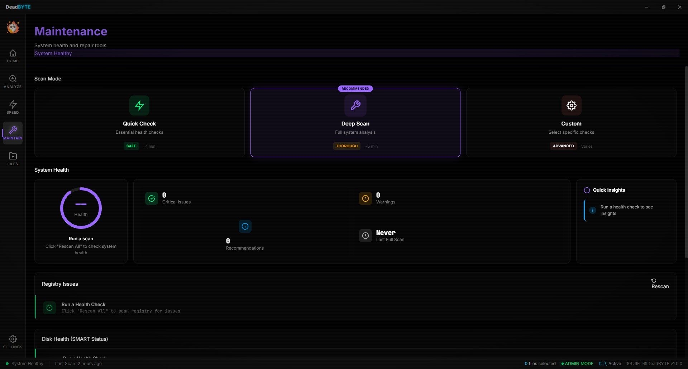

<p align="center">
  
</p>

<h1 align="center">DeadBYTE</h1>

<p align="center">
  <strong>Advanced File Management & System Control for Windows</strong>
</p>

<p align="center">
  <a href="https://github.com/moneraldabai-ui/DeadByte/releases/latest">
    
  </a>
  <a href="https://github.com/moneraldabai-ui/DeadByte/releases">
    
  </a>
  <a href="LICENSE">
    
  </a>
  <a href="https://github.com/moneraldabai-ui/DeadByte/stargazers">
    
  </a>
</p>

<p align="center">
  <a href="#-features">Features</a> •
  <a href="#-screenshots">Screenshots</a> •
  <a href="#-installation">Installation</a> •
  <a href="#-download">Download</a> •
  <a href="#-contributing">Contributing</a>
</p>

---

## Why DeadBYTE?

Tired of files you can't delete? Processes that won't stop? System clutter slowing you down?

**DeadBYTE** is a powerful, open-source Windows utility that gives you complete control over your system. Built with Electron for a modern, sleek interface while providing deep system access that other tools can't match.

---

## ✨ Features

<table>
<tr>
<td width="50%">

### 🗂️ File Management
- **Force Delete** - Remove locked/stubborn files
- **Permission Manager** - View & modify NTFS permissions
- **Ownership Control** - Take ownership instantly
- **File Browser** - Navigate all drives seamlessly

</td>
<td width="50%">

### ⚡ System Control
- **Process Manager** - Kill any process
- **Service Manager** - Start/Stop Windows services
- **Startup Manager** - Control what runs at boot
- **Real-time Monitoring** - Live system stats

</td>
</tr>
<tr>
<td width="50%">

### 🧹 Maintenance
- **Junk Cleaner** - Remove temp files & clutter
- **System Optimizer** - Boost performance
- **Drive Analyzer** - Visualize disk usage
- **Auto Maintenance** - Scheduled cleanup

</td>
<td width="50%">

### 🔒 Security
- **Admin Mode** - Full system privileges
- **Operation Logging** - Track all changes
- **USB Detection** - Real-time drive monitoring
- **Auto Updates** - Stay secure & current

</td>
</tr>
</table>

---

## 📸 Screenshots

<p align="center">
  
</p>

<details>
<summary><b>View More Screenshots</b></summary>
<br>

| Analyzer | Clean | Files |
|----------|-------|-------|
|  |  |  |

| Settings | Maintenance |
|----------|-------------|
|  |  |

</details>

---

## 📥 Download

### Latest Release: v1.0.2

| Type | Download | Description |
|------|----------|-------------|
| **Installer** | [DeadBYTE-1.0.2-win-x64.exe](https://github.com/moneraldabai-ui/DeadByte/releases/download/v1.0.2/DeadBYTE-1.0.2-win-x64.exe) | Recommended - Full installation |
| **Portable** | [DeadBYTE-1.0.2-Portable.exe](https://github.com/moneraldabai-ui/DeadByte/releases/download/v1.0.2/DeadBYTE-1.0.2-Portable.exe) | No installation required |

> **Requirements:** Windows 10/11 (64-bit) • Administrator privileges

---

## 🚀 Installation

### Option 1: Download Release (Recommended)
1. Download the [latest installer](https://github.com/moneraldabai-ui/DeadByte/releases/latest)
2. Run `DeadBYTE-1.0.2-win-x64.exe`
3. Follow installation wizard
4. Launch DeadBYTE from desktop/Start menu

### Option 2: Build from Source
```bash
# Clone repository
git clone https://github.com/moneraldabai-ui/DeadByte.git
cd DeadByte

# Install dependencies
npm install

# Run application
npm start

# Build installer
npm run build
```

---

## 🛠️ Tech Stack

| Technology | Purpose |
|------------|---------|
|  | Desktop Framework |
|  | Backend Services |
|  | Application Logic |
|  | UI Structure |
|  | Styling |

---

## 📁 Project Structure

```
DeadBYTE/
├── electron.js          # Main process
├── preload.js           # IPC bridge
├── src/
│   ├── index.html       # Application UI
│   ├── main.js          # Renderer logic
│   ├── styles/          # CSS stylesheets
│   └── assets/          # Icons & images
├── backend/
│   ├── fileService.js        # File operations
│   ├── processService.js     # Process management
│   ├── forceDeleteService.js # Force delete
│   ├── junkService.js        # Cleanup
│   └── ...                   # Other services
└── installer/           # Build scripts
```

---

## 🤝 Contributing

Contributions are welcome! Here's how you can help:

1. **Fork** the repository
2. **Create** a feature branch (`git checkout -b feature/amazing-feature`)
3. **Commit** changes (`git commit -m 'Add amazing feature'`)
4. **Push** to branch (`git push origin feature/amazing-feature`)
5. **Open** a Pull Request

### Ideas for Contribution
- [ ] Dark theme 
- [ ] Registry cleaner
- [ ] Duplicate file finder
- [ ] Disk defragmentation

---

## 📜 License

This project is licensed under the **MIT License** - see the [LICENSE](LICENSE) file for details.

---

## 👤 Author

**M. O. N. E. R**

- GitHub: [@moneraldabai-ui](https://github.com/moneraldabai-ui)
- Email: moner.aldabai@gmail.com

---

## ⭐ Support

If you find DeadBYTE useful, please consider:

- **Starring** this repository ⭐
- **Sharing** with others who might benefit
- **Reporting** bugs or suggesting features

---

<p align="center">
  Made with ❤️ for Windows power users
</p>

<p align="center">
  <a href="https://github.com/moneraldabai-ui/DeadByte/issues">Report Bug</a> •
  <a href="https://github.com/moneraldabai-ui/DeadByte/issues">Request Feature</a>
</p>
